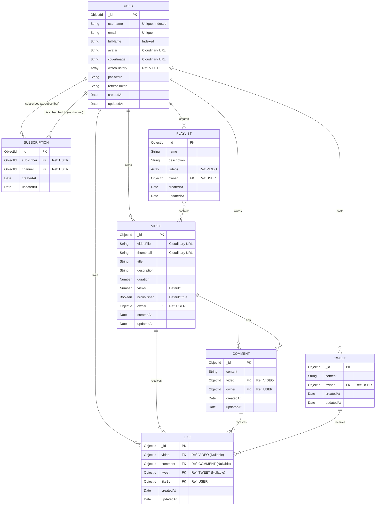

# Stargazer Social Galaxy

A full-stack social media application that allows users to share videos, post tweets, comment, like, subscribe to channels, and create playlists. This repository is structured as a monorepo, containing both the frontend and the backend of the application.

## 🚀 Tech Stack

### Frontend
- **Framework:** React with Vite (SWC) and TypeScript
- **Styling:** Tailwind CSS
- **Components:** shadcn/ui (based on Radix UI)
- **Routing:** React Router DOM
- **State Management & Data Fetching:** React Query (@tanstack/react-query), Axios
- **Forms & Validation:** React Hook Form, Zod
- **Icons & Charts:** Lucide React, Recharts

### Backend
- **Runtime:** Node.js
- **Framework:** Express.js
- **Database:** MongoDB with Mongoose (with mongoose-aggregate-paginate-v2 for pagination)
- **Authentication:** JWT (JSON Web Tokens) and bcrypt for password hashing
- **File Uploads:** Multer and Cloudinary
- **Environment & Security:** dotenv, cors, cookie-parser

## 📁 Repository Structure

```
stargazer-social-galaxy/
├── frontend/             # React (Vite) frontend application
│   ├── public/           # Static assets
│   ├── src/              # Frontend source code
│   │   ├── components/   # Reusable UI components (shadcn/ui, etc.)
│   │   └── ...           # Pages, hooks, utilities, context, etc.
│   ├── package.json
│   ├── tailwind.config.ts
│   └── vite.config.ts
│
├── backend/              # Node.js + Express backend application
│   ├── src/              # Backend source code
│   │   ├── controllers/  # Route controllers (business logic)
│   │   ├── db/           # Database connection setup
│   │   ├── middlewares/  # Express middlewares (auth, multer, etc.)
│   │   ├── models/       # Mongoose schema definitions
│   │   ├── routes/       # API routes
│   │   ├── utils/        # Utility functions (async handler, API error/response)
│   │   ├── app.js        # Express app configuration
│   │   ├── constants.js  # Project constants
│   │   └── index.js      # Server entry point
│   ├── package.json
│   └── render.yaml       # Render deployment configuration
└── README.md             # This file
```

## 🗄️ Database Schema

Below is the Entity-Relationship diagram illustrating the MongoDB schema definitions used in the backend:


